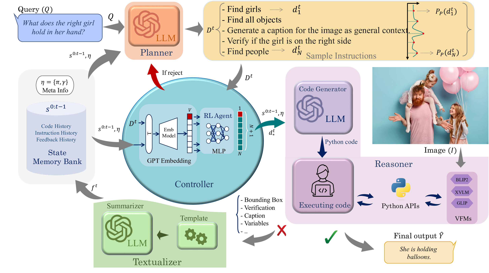

#  HYDRA: A Hyper Agent for Dynamic Compositional Visual Reasoning

<div align="center">
    
    <p></p>
</div>


<div align="center">
    <a href="https://github.com/ControlNet/HYDRA/issues">
        
    </a>
    <a href="https://github.com/ControlNet/HYDRA/network/members">
        
    </a>
    <a href="https://github.com/ControlNet/HYDRA/stargazers">
        
    </a>
    <a href="https://github.com/ControlNet/HYDRA/blob/master/LICENSE">
        
    </a>
    <a href="https://arxiv.org/abs/2403.12884">
        
    </a>
</div>

<div align="center">    
    <a href="https://pypi.org/project/hydra-vl4ai/">
        
    </a>
    <a href="https://pypi.org/project/hydra-vl4ai/">
        
    </a>
    <a href="https://www.python.org/"></a>
</div>

**This is the code for the paper [HYDRA: A Hyper Agent for Dynamic Compositional Visual Reasoning](https://link.springer.com/chapter/10.1007/978-3-031-72661-3_8), accepted by ECCV 2024 \[[Project Page](https://hydra-vl4ai.github.io)\]. We released the code that <span style="color: #FF6347; font-weight: bold;">uses Reinforcement Learning (DQN) to fine-tune the LLM</span>🔥🔥🔥**

## Release

- [2025/02/11] 🤖 HYDRA with RL is released.
- [2024/08/05] 🚀 [PYPI package](https://pypi.org/project/hydra-vl4ai/) is released.
- [2024/07/29] 🔥 **HYDRA** is open sourced in GitHub.

## TODOs
We realize that `gpt-3.5-turbo-0613` is deprecated, and `gpt-3.5` will be replaced by `gpt-4o-mini`. We will release another version of HYDRA.
>As of July 2024, `gpt-4o-mini` should be used in place of `gpt-3.5-turbo`, as it is cheaper, more capable, multimodal, and just as fast [Openai API Page](https://platform.openai.com/docs/models/gpt-3-5-turbo).

We also notice the embedding model is updated by OpenAI as shown in this [link](https://openai.com/index/new-embedding-models-and-api-updates/). Due to the uncertainty of the embedding model updates from OpenAI, we suggest you train a new version of the RL controller yourself and update the RL models.
- [x] GPT-4o-mini replacement.
- [x] LLaMA3.1 (ollama) replacement.
- [x] Gradio Demo
- [x] GPT-4o Version.
- [x] HYDRA with RL(DQN).
- [ ] HYDRA with Deepseek R1.

https://github.com/user-attachments/assets/39a897ab-d457-49d2-8527-0d6fe3a3b922

## Installation

### Requirements

- Python >= 3.10
- conda

Please follow the instructions below to install the required packages and set up the environment.

### 1. Clone this repository.
```Bash
git clone https://github.com/ControlNet/HYDRA
```

### 2. Setup conda environment and install dependencies. 

Option 1: Using [pixi](https://prefix.dev/) (recommended):
```Bash
pixi install
pixi shell
```

Option 2: Building from source:
```Bash
bash -i build_env.sh
```
If you meet errors, please consider going through the `build_env.sh` file and install the packages manually.

### 3. Configure the environments

Edit the file `.env` or setup in CLI to configure the environment variables.

```
OPENAI_API_KEY=your-api-key  # if you want to use OpenAI LLMs
OLLAMA_HOST=http://ollama.server:11434  # if you want to use your OLLaMA server for llama or deepseek
# do not change this TORCH_HOME variable
TORCH_HOME=./pretrained_models
```

### 4. Download the pretrained models
Run the scripts to download the pretrained models to the `./pretrained_models` directory. 

```Bash
python -m hydra_vl4ai.download_model --base_config <EXP-CONFIG-DIR> --model_config <MODEL-CONFIG-PATH>
```

For example,
```Bash
python -m hydra_vl4ai.download_model --base_config ./config/okvqa.yaml --model_config ./config/model_config_1gpu.yaml
```

## Inference
A worker is required to run the inference. 

```Bash
python -m hydra_vl4ai.executor --base_config <EXP-CONFIG-DIR> --model_config <MODEL-CONFIG-PATH>
```

### Inference with given one image and prompt
```Bash
python demo_cli.py \
  --image <IMAGE_PATH> \
  --prompt <PROMPT> \
  --base_config <YOUR-CONFIG-DIR> \
  --model_config <MODEL-PATH>
```

### Inference with Gradio GUI
```Bash
python demo_gradio.py \
  --base_config <YOUR-CONFIG-DIR> \
  --model_config <MODEL-PATH>
```

---
### Inference dataset

```Bash
python main.py \
  --data_root <YOUR-DATA-ROOT> \
  --base_config <YOUR-CONFIG-DIR> \
  --model_config <MODEL-PATH>
```

Then the inference results are saved in the `./result` directory for evaluation.

## Evaluation

```Bash
python evaluate.py <RESULT_JSON_PATH> <DATASET_NAME>
```

For example,

```Bash
python evaluate.py result/result_okvqa.jsonl okvqa
```

## Training Controller with RL(DQN)

```Bash
python train.py \
    --data_root <IMAGE_PATH> \
    --base_config <YOUR-CONFIG-DIR>\
    --model_config <MODEL-PATH> \
    --dqn_config <YOUR-DQN-CONFIG-DIR>
```
For example,
```Bash
python train.py \
    --data_root ../coco2014 \
    --base_config ./config/okvqa.yaml\
    --model_config ./config/model_config_1gpu.yaml \
    --dqn_config ./config/dqn_debug.yaml
```

## Citation
```bibtex
@inproceedings{ke2024hydra,
  title={HYDRA: A Hyper Agent for Dynamic Compositional Visual Reasoning},
  author={Ke, Fucai and Cai, Zhixi and Jahangard, Simindokht and Wang, Weiqing and Haghighi, Pari Delir and Rezatofighi, Hamid},
  booktitle={European Conference on Computer Vision},
  year={2024},
  organization={Springer},
  doi={10.1007/978-3-031-72661-3_8},
  isbn={978-3-031-72661-3},
  pages={132--149},
}
```

## Acknowledgements

Some code and prompts are based on [cvlab-columbia/viper](https://github.com/cvlab-columbia/viper).
